# Expanding DeFi on Flow EVM with Cadence Orchestration

This document outlines various opportunities to grow the DeFi ecosystem on Flow by leveraging its new Ethereum Virtual Machine (EVM) support, alongside the unique features of the Cadence programming language. The overarching goal is to increase total value locked (TVL) on Flow by bringing over established DeFi building blocks, innovating with new primitives, and enabling complex strategies through atomic orchestration.

---

## 1. Porting Established DeFi Primitives

### 1.1 Automated Market Makers (AMMs)

- **Uniswap v2, v3, v4**  
  - **v2**: Classic constant-product market maker.  
  - **v3**: Concentrated liquidity, enabling LPs to choose a price range for more capital efficiency.  
  - **v4**: Potential for custom “hooks” to extend liquidity and fee mechanisms.  

- **Curve Stable Pools**  
  - Hybrid function that behaves like constant sum near equilibrium, reducing slippage for stablecoins.

**Rationale**  
Bringing these well-known AMMs to Flow EVM provides immediate liquidity solutions and yield-farming opportunities. Users migrating from Ethereum will find a familiar interface, while newcomers to DeFi can access proven tools.

---

### 1.2 Lending Protocols

- Protocols like **Aave**, **Compound**, or **Morpho** for borrowing/lending markets.  
- Highly important for tapping into leverage, earning interest, and supporting money markets.

**Rationale**  
These protocols anchor most DeFi ecosystems by facilitating on-chain credit. Porting them can drive substantial TVL growth and cross-protocol synergy (e.g., borrowed assets for yield farming).

---

### 1.3 Yield Tokenization (Pendle Finance & Beyond)

- **Pendle Finance** splits yield-bearing tokens into principal (PT) and yield (YT) components.  
- Enables separate trading of principal and yield, opening new opportunities for interest-rate speculation or yield optimization.

**Rationale**  
Advanced yield tokenization draws in sophisticated investors who want fine-grained control over their exposure to interest rates. Offering these functionalities on Flow EVM can attract more complex strategies and capital inflows.

---

### 1.4 Leveraged Yield Farming

- Borrow assets from a lending protocol to **amplify** positions in an AMM (like Uniswap v3).  
- Users deposit collateral, borrow stablecoins or other tokens, and then provide concentrated liquidity at a chosen range.  
- Can **compound yields** but also needs robust liquidation/maintenance margin logic to manage risk.

**Rationale**  
Leveraged yield farming is a proven TVL driver on other chains. With Cadence’s atomic transactions, users could open, close, and adjust leveraged LP positions in one seamless flow, mitigating partial-step risk.

---

## 2. Advanced Orchestration with Cadence

Flow’s resource-oriented Cadence language can coordinate EVM actions atomically, ensuring multi-step DeFi strategies execute fully or revert to a safe state.

### 2.1 Atomic & Composable Transactions

1. **Borrow** using collateral locked in a lending protocol.  
2. **Provide Liquidity** on an AMM (e.g., Uniswap v3) with a specific price range.  
3. If the price exits that range, automatically **close** the LP position, **repay** the loan, and **liquidate** any remaining assets—all in a single atomic transaction.

**Benefits**  
- Fewer on-chain steps for the user, reducing transaction fees and complexity.  
- Lower operational risk, since either everything completes or nothing does.

### 2.2 Lower Block Times & Continuous Margin Checks

- Flow’s lower block times make it more feasible to replicate **Deribit-style** margin maintenance, where a user can open a perpetual position and simultaneously buy/sell options, with real-time checks on collateral.  
- Cadence can coordinate immediate liquidations or adjustments if margin requirements are not met.

**Benefits**  
- More sophisticated margining systems become possible, appealing to advanced derivatives traders.  
- Reduces “waiting risk” inherent in slower block-time environments.

### 2.3 Staked & Exotic Collateral

- Users could collateralize positions with **staked tokens** (e.g., staked ETH) or **AMM LP tokens** themselves.  
- This is rarely available on centralized exchanges, offering a unique DeFi advantage.  
- Potential for layered strategies: e.g., using an LP token that itself earns yield, while simultaneously opening a power perpetual or a perpetual option.

**Benefits**  
- More capital efficiency: staked or yield-bearing collateral continues earning rewards.  
- Uniquely attractive to traders who want to “stack” yield on top of leveraged positions.

---

## 3. Introducing New Derivatives

### 3.1 Perpetual Options

- **No Expiry**: Similar to perpetual futures but structured as call/put options.  
- **Funding Fees** maintain equilibrium between buyers and sellers.  
- Can have dynamic or rolling strike prices.

**Rationale**  
Provides indefinite optionality for traders who prefer “option-like” payoffs without rolling over monthly expiries. This captures **Gamma** exposure that linear perpetuals miss, attracting options-based hedgers and speculators.

### 3.2 Power Perpetuals

- **Asset^2 or Asset^3** exposures for non-linear gains or losses.  
- Positions avoid immediate liquidation purely on price drops, relying on **funding payments** to sustain.  
- Creates amplified upside (and complex downside) with less typical margin calls.

**Rationale**  
Offers exotic leveraged exposure that differs from standard x2 or x3 leveraged tokens. Traders can benefit from squared or cubed payoff profiles, attracting those who want high volatility or advanced hedging strategies.

---

## 4. Centralized Exchange Features for DeFi

### 4.1 Multi-Leg Strategies & Unified Margin

- **Options + Perpetuals** in one account, similar to how Deribit allows ETH collateral with an option position plus perpetual futures.  
- **Cross-margin** to manage multiple correlated positions, optimizing margin usage and reducing liquidation risk.

### 4.2 Conditional Orders & Advanced Order Types

- **Stop-loss, trailing stops, limit orders** orchestrated on-chain or semi-on-chain.  
- Cadence can handle triggers or incorporate an oracle-based approach to automatically execute trades when certain price conditions are met.

### 4.3 Combining AMMs & Options

- Centralized exchanges typically rely on order books. AMMs let users deposit liquidity and earn fees passively.  
- Lower barrier for users to earn yield without running complex market-maker infrastructure.

**Rationale**  
Replicates many advanced trading tools from centralized exchanges, but in a trustless, on-chain setting. Flow’s throughput and Cadence-driven orchestration make real-time margin maintenance and advanced order strategies more viable.

---

## 5. Combining Yield Tokenization with Expiry-Based Derivatives

- **PT (Principal Token) + YT (Yield Token)** often carry an expiry (e.g., yield accrues until maturity).  
- **Options and Futures** also use expiry.  
- Potential for structured products that align yield token expiration with option expiration, creating interesting payoffs (e.g., lock in a fixed yield while writing covered calls that mature simultaneously).

### Possible Innovations

- **Fixed-End DeFi Products**: Where both the principal and the option expire on the same date, simplifying payoff scenarios.  
- **Hedging Interest Rate Volatility**: Trade the YT portion while holding an option that matures concurrently, reducing the overall rate-exposure risk.  
- **Yield Curve Strategies**: Build swap-like products that capture or hedge yield changes over specific intervals, akin to interest rate swaps in TradFi.

---

## 6. Why These Protocols & Strategies Are Needed

1. **Broader Range of Financial Products**  
   - Capturing **gamma** (via options) and **non-linear payoffs** (via power perpetuals) appeals to more sophisticated traders.  
   - Filling the gap between simple perpetuals and advanced derivatives found in traditional finance.

2. **Composability & User Control**  
   - DeFi users can combine staked assets, yield tokens, leveraged LP positions, and derivatives all on-chain.  
   - Retains user custody of assets without trusting a centralized exchange.

3. **Potential for Higher TVL**  
   - Each new DeFi primitive (AMM, lending, yield tokenization, options, advanced derivatives) typically boosts locked liquidity.  
   - More sophisticated products encourage capital inflows from traders seeking yield or hedging.

4. **Ease of Earning Yield**  
   - Automated market makers provide yield opportunities to everyday users who can’t run professional market-making bots.  
   - Staking or LP tokens as collateral let users “double dip” on rewards (e.g., earn yield while also holding a leveraged or option position).

---

## 7. Path Forward

1. **Immediate**  
   - **Fork** existing DeFi protocols (Uniswap, Curve, Lending) onto Flow EVM for fast liquidity bootstrapping.  
   - Provide guides/tools so users can replicate strategies they know from Ethereum.

2. **Intermediate**  
   - **Leverage Cadence** for atomic multi-step transactions (e.g., leveraged yield farming, auto-liquidation triggers).  
   - Integrate oracles (Chainlink or native Flow oracles) for on-chain price feeds.

3. **Long-Term**  
   - Develop **power perpetuals**, **perpetual options**, **multi-leg margin systems**, and **cross-collateral** solutions that are unique to Flow.  
   - Introduce advanced structured products, combining yield tokens and expiry-based derivatives to create novel payoff profiles.

---

## 8. Conclusion

Flow’s EVM integration opens the door for established DeFi protocols to migrate seamlessly, attracting immediate TVL. More importantly, Cadence’s resource-oriented paradigm and rapid block times enable advanced features that surpass what is typically available on Ethereum mainnet:

- **Atomic multi-step strategies** that reduce user friction and partial-execution risk.  
- **Sophisticated derivatives** (power perpetuals, perpetual options, cross-margin solutions).  
- **Collateral innovation** using staked tokens, yield tokens, and AMM LP tokens.  
- **New structured products** aligning different expiry-based assets.

By combining proven DeFi building blocks with Flow’s unique technology, the ecosystem can deliver an integrated platform for both casual yield farmers and sophisticated derivatives traders—driving higher TVL and setting Flow apart in an increasingly competitive DeFi landscape.

# Platform: Deribit

This section compiles all **Deribit** screenshots, each with detailed commentary and a final **Black–Scholes** discussion. The goal is to illustrate how Deribit operates and draw parallels to potential Flow EVM/Cadence-based DeFi solutions.

---

## **Screenshot 1**  
**Title**: *Deribit Dashboard / Landing*  
**Reference**:  

### **Observations / Commentary**

1. **Dashboard Overview**  
   - Displays **Total Account Value** (`$13.73` in the example), which aggregates the user’s net holdings.  
   - Upper navigation includes tabs for **Spot**, **Futures**, **Options**, and **Strategy**, plus sub-tools (Price Ladder, Option Wizard).  
   - The layout is quite minimal when there are **no open positions**, focusing on a “Welcome” banner and the user’s ID.

2. **Assets & Quick Actions**  
   - Lists balances in BTC and ETH, each with an approximate USD conversion.  
   - **Trade** and **Wallet** buttons beside each asset provide quick deposit, withdrawal, or trading flows.  
   - Intended to simplify moving between spot trading, derivatives, and account funding.

3. **Positions & Greeks**  
   - Tabs (Positions, Open Orders, Your Trades, Expiry Greeks) appear but are empty if the user hasn’t placed trades.  
   - “Expiry Greeks” is unique to Deribit, giving an at-a-glance measure of Delta, Gamma, etc., near expiry if you have open options.

4. **What’s Hot / Trending**  
   - A side panel highlights the most actively traded Options and Futures (by 24h volume or performance).  
   - Users can quickly see which contracts are in demand or spiking in volume.

### **What It Has**

- **Clean, All-in-One Dashboard**: Aggregates account value, positions, asset balances, and top traded instruments.  
- **Seamless Navigation**: Quick pivot to spot trading, futures, options, or advanced strategy tools.  
- **Intro to Options Focus**: The presence of “Expiry Greeks” and “What’s Hot” points to an options-centric exchange.

### **What Might Be Missing (Compared to a DeFi Perspective)**

1. **On-Chain Collateral or Composability**  
   - Only BTC/ETH custodial wallets shown. No resource-oriented approach or bridging in staked tokens, yield-farming positions, etc.  
   - In DeFi, you might see staked tokens, LP tokens, or multi-asset collateral displayed seamlessly on a single dashboard.

2. **Atomic Multi-Step Transactions**  
   - No built-in ability to do “borrow from lending protocol → trade on derivatives → repay or hedge” in one go.  
   - DeFi with Cadence can unify these steps in a single, revertible transaction for safety.

3. **Unified Margin**  
   - Although Deribit does margin for futures and options, it’s still centralized logic. DeFi might unify margin across multiple protocols with real-time checks on everything from AMM LP positions to staked governance tokens.

### **Ideas / Suggestions (Drawing from This UI)**

1. **Flow-Based Unified Dashboard**  
   - Present user’s staked Flow, LP tokens, borrowed stablecoins, and any open derivatives positions in one place.  
   - Each asset is a “resource” in Cadence, making movements explicit and safe.

2. **Interactive Hot Panel**  
   - Show “hottest” DeFi pools, top lending APYs, or trending option strikes, all referencing on-chain data in real time.  
   - Encourages user exploration without leaving the main dashboard.

3. **Atomic Onboarding**  
   - A single “Start Trading” transaction could deposit collateral, open an option or future, and sign the user up for a yield aggregator.  
   - Eliminates friction from multiple sign-ups or bridging steps.

### **Comparisons / Where It Could Go**
- **Compared to Deribit**: A Flow EVM interface could replicate this minimal, accessible style but display DeFi positions, yield accrual, and resource-based security.  
- **Potential Next Steps**: Build a “Flow DeFi Dashboard” that merges lending, options, yield-farming, and aggregator stats in an all-in-one layout with resource-driven security.

---

## **Screenshot 2**  
**Title**: *Deribit Account Summary & Margin Table*  
**Reference**:  

### **Observations / Commentary**

1. **Segregated vs. Cross Margin**  
   - Shows columns for each asset (BTC, ETH, SOL, XRP, etc.) with Equity, PnL, Fee Balance, “Gamma,” “Vega,” “Theta,” and other risk parameters.  
   - The right side has Margin Balance, Available Balance, IM (Initial Margin), and MM (Maintenance Margin) projected.

2. **Real-Time Margin Model**  
   - Deribit updates margin requirements based on your open positions and Greeks. For example, if your overall Delta or Vega is large, margin usage can spike.  
   - Offers partial cross margin across instruments but remains within Deribit’s closed ecosystem.

3. **Tabbed Expiries at the Bottom**  
   - Quick access to options or futures for each expiry date. Users can see open interest, mark prices, etc.  
   - The current underlying is around \$91,320 (for BTC), illustrating high crypto price volatility if this is a far-future date.

4. **Visibility of “Available Balance”**  
   - Tells the user how much collateral remains for new trades.  
   - The system notifies you if your margin is insufficient for further positions.

### **What It Has**

- **Sophisticated Margin Table**: Summaries for each asset plus real-time risk metrics (Gamma, Vega, Theta, etc.).  
- **Integrated Option Expiries**: Directly from the bottom panel, bridging margin info to actual trading.  
- **Detailed Projected Maintenance Margin**: Minimizes margin call surprises by anticipating near-future changes.

### **What Might Be Missing (Compared to a DeFi Perspective)**

1. **Composable Cross-Margin**  
   - This margin system only covers Deribit’s platform. DeFi could unify margin across different protocols: lending, AMM, yield aggregator, etc.  
   - Real-time cross-protocol margin is more powerful but also more complex.

2. **Yield-Bearing or Staked Collateral**  
   - All listed assets are base cryptos or stablecoins. No mention of interest-earning positions.  
   - In DeFi, your collateral might be continuously accruing yield while also backing an options or futures position.

3. **On-Chain Risk Transparency**  
   - The “Gamma,” “Vega,” and “Theta” data is generated off-chain. A DeFi approach might allow anyone to verify or recalculate these risk metrics from on-chain transactions or oracles.

### **Ideas / Suggestions (Drawing from This UI)**

1. **On-Chain Greek Calculators**  
   - A Flow-based protocol could similarly compute Greeks on-chain (or via oracles) for user positions, giving advanced risk metrics.

2. **Cross-Asset & Cross-Protocol Margin**  
   - In a Flow DeFi system, margin usage could factor in multiple protocols: e.g., a user’s borrowed USDC, staked ETH, and an AMM LP position.  
   - Cadence could orchestrate real-time margin checks across these protocols to handle partial unwinds or top-ups automatically.

3. **Composite Collateral**  
   - Users could pledge staked tokens or LP tokens as collateral while earning yield.  
   - Margin is dynamically adjusted by a central manager contract or aggregator that monitors the user’s net liquidity across the ecosystem.

4. **Greek-Driven Liquidation Logic**  
   - In a resource-based system, if a user’s “Delta Total (Projected)” crosses a threshold, the system could automatically execute a partial liquidation to reduce risk.  
   - Could be done atomically through Cadence transactions without manual intervention.

### **Comparisons / Where It Could Go**
- **Compared to Deribit**  
  - A Flow DeFi platform can match Deribit’s robust margin model but extend it to unique collateral types and multi-protocol exposure.  
  - Transparent on-chain data for Greeks, margin usage, and liquidation thresholds could build trust and reduce opaqueness.

- **Potential Next Steps**  
  - Implement a multi-protocol margin aggregator on Flow EVM, using Cadence to track user positions across lending pools, AMMs, and derivative contracts.  
  - Offer advanced data analytics, including Greeks, while letting users supply staked collateral and remain eligible for auto-liquidation triggers.

---

## **Screenshot 3**  
**Title**: *BTC Perpetual Trading Interface*  
**Reference**:  

### **Observations / Commentary**

1. **Real-Time Chart & Order Book**  
   - Classic candlestick chart with volume, plus an order book showing live bids/asks.  
   - Shows a “Funding/8h” rate typical of perpetual swaps.

2. **Leverage & Order Parameters**  
   - Users can toggle “Market,” “Limit,” “Post-Only,” “Reduce-Only,” as well as set **Leverage** up to x50.  
   - Possibly combined with “Take Profit” or “Stop Loss” in one order form.

3. **Perpetual Swap Premium**  
   - “Premium” indicates whether the perpetual is trading above or below the spot index.  
   - Funding is paid or received depending on which side you’re on if the market trades off-index.

### **What It Has**

- **Deep Liquidity**: A central order book with presumably high trade volumes for BTC.  
- **Advanced Execution**: Built-in parameter toggles, advanced orders, and partial or full position closing.

### **What Might Be Missing (Compared to a DeFi Perspective)**

1. **Collateral Diversity**  
   - Again, just base assets like BTC or ETH. In DeFi, you could deposit staked ETH or stablecoins from a lending pool to go long or short.

2. **Permissionless Trading**  
   - Deribit is custodial and centralized. A DeFi solution would keep user funds in user-controlled wallets.

3. **Composability**  
   - No direct way to feed this perpetual position as collateral for an option, or vice versa, in the same atomic flow.

### **Ideas / Suggestions (Drawing from This UI)**

1. **AMM or Hybrid Perpetual DEX**  
   - Flow EVM could support an AMM-based model (like GMX or dYdX’s approach on L2) with on-chain matching.  
   - Cadence could enforce margin checks and handle funding payments automatically.

2. **Atomic Borrow & Perpetual**  
   - A user might borrow stablecoins from a Flow lending protocol, then open a short or long in one transaction.

3. **Customizable On-Chain Funding**  
   - The funding rate might be decided by a DAO or automatically adjusted if an on-chain index deviates from the perp’s price.

4. **Combine with Option Positions**  
   - Some DeFi protocols let users run a “perp + option” strategy in one place.  
   - Could set up a transaction where the user simultaneously opens a perp position and sells a covered call, with margin managed in a single Cadence-based flow.

### **Comparisons / Where It Could Go**
- **Compared to a DeFi Perp DEX**  
  - Deribit’s UI is streamlined for professional traders, but DeFi can unify multiple protocols (lending, yield, options) behind the scenes.  
  - On-chain, all actions are transparent and verifiable, which can build trust among users who are wary of centralized matching engines.

- **Potential Next Steps**  
  - Implement an AMM-based or hybrid order book for perpetuals on Flow EVM, with real-time funding calculations managed by Cadence.  
  - Expand collateral to staked/LP tokens, giving users the unique advantage of yield while holding a leveraged position.

---

## **Screenshot 4**  
**Title**: *BTC Options Chain*  
**Reference**:  

### **Observations / Commentary**

1. **Classic Options Chain**  
   - Strikes listed down the middle, calls on the left, puts on the right.  
   - Shows Delta, IV, Bid/Ask for each side, plus an aggregated Mark.

2. **Tabbed Expiries**  
   - Users can quickly jump between different maturity dates.  
   - Could see how IV or open interest changes across the term structure.

3. **Implied Volatility Display**  
   - Each strike has an associated implied volatility. This is presumably recalculated off-chain by Deribit’s engine.  
   - Vital for options traders deciding which strike to buy or sell.

### **What It Has**

- **Pro-Level Interface**: Similar to CME or standard equities option chain.  
- **Real-Time Bids & Asks**: For each strike, letting traders see the liquidity and potential slippage.  
- **Flexible Expiries & Underlying**: Could be BTC or ETH with multiple monthly or quarterly expiries.

### **What Might Be Missing (Compared to a DeFi Perspective)**

1. **On-Chain Options Settlement**  
   - Settlement is entirely reliant on Deribit’s central matching engine and final price feeds.

2. **Composability / Multi-Leg**  
   - While you can do multi-leg, it’s still under Deribit’s closed environment. DeFi might unify multiple positions across lending/AMMs.

3. **Staked Collateral**  
   - No direct usage of yield tokens or NFT-collateral for writing options.

### **Ideas / Suggestions (Drawing from This UI)**

1. **Flow EVM Option Protocol**  
   - Replicate or surpass the chain approach, but settlement and margin are on-chain.  
   - Could incorporate oracles for implied volatility or use an AMM-like pool for option liquidity (like Hegic or Lyra on other chains).

2. **Advanced Automated Strategies**  
   - DeFi might let you build a “covered call vault” that sells calls against a staked asset, distributing premium to depositors.  
   - In a single transaction, a user deposits tokens, a contract sells calls weekly, and the yield is auto-compounded.

3. **Strike Groupings or Liquidity Pools**  
   - Instead of a pure order book, some DeFi options revolve around liquidity pools that cover multiple strikes.  
   - This can be simpler for new users but requires complex risk management.

---

## **Screenshot 5**  
**Title**: *Deribit Option Order Form*  
**Reference**:  

### **Observations / Commentary**

1. **Limit/USD/IV Pricing**  
   - Users can place an order by specifying a limit price in BTC, or directly in USD, or by desired implied volatility.  
   - This is a high-level feature for advanced traders who target an IV rather than a direct price.

2. **Buy vs. Sell Margin**  
   - The form shows how much margin is needed if you buy (debit risk) vs. sell (credit risk).  
   - Also can see “Position MM Impact” to reflect how it changes your overall margin.

3. **Greeks Panel**  
   - Displays Greeks (Delta, IV, etc.) in real time, plus a Mark Price, future mark, 24h volume, and Lambda.  
   - Traders can decide if the contract is overpriced or underpriced relative to its implied volatility.

### **What It Has**

- **Rich Order Entry**: Multiple ways to define an order, from price-based to volatility-based.  
- **Immediate Margin Calculation**: Minimizes guesswork for how much BTC or ETH you must lock up.  
- **Greeks Integration**: Nudges traders to consider how each position adds or reduces risk.

### **What Might Be Missing (Compared to a DeFi Perspective)**

1. **Collateral Token Diversity**  
   - Only BTC margin. DeFi might allow staked ETH, stablecoins, or even yield tokens.  
   - No synergy with cross-protocol positions.

2. **Atomic Multi-Leg Orders**  
   - Traders must open individual positions manually. DeFi could allow bundling multiple option legs plus collateral deposit in one transaction.

3. **Automation / Smart Vaults**  
   - In DeFi, vault strategies might automatically roll expiring options or adjust strike prices based on user preferences.

### **Ideas / Suggestions (Drawing from This UI)**

1. **IV-Based Order Placement in DeFi**  
   - A Flow-based options protocol could let users specify an implied volatility target rather than just a price.  
   - Could be useful in lower-liquidity environments to systematically trade based on implied volatility preferences.

2. **Composability with Borrowing & Hedging**  
   - In one Cadence-driven flow, a user might borrow stablecoins, buy a call option, and hedge with a short on another protocol, all in one step.

3. **Automated Rolling**  
   - Smart contracts could automatically roll options on expiry if conditions are met (e.g., user sets a threshold IV, or a target strike).  
   - Saves users from manual overhead and mitigates risk of forgetting to roll.

4. **Collateral Token Selection**  
   - Let users pick from a list of whitelisted or yield-bearing collateral tokens.  
   - The UI shows margin calculations for each collateral type, factoring in staked yields or token conversion rates.

---

## **Screenshot 6**  
**Title**: *Option Contract Details*  
**Reference**:  

### **Observations / Commentary**

1. **Contract Specs**  
   - Mark Price, Price Source (Deribit BTC Index), Contract Size, Min Order Size, Tick Size, Settlement Currency, Expiry Date.  
   - All visible in one panel before execution.

2. **Delta, Gamma, Vega, Theta, Rho**  
   - Each option contract references these Greeks to indicate sensitivity to underlying price, volatility, and time.  
   - Useful for institutional traders who manage large option books.

3. **Margin Requirements**  
   - Immediate “Buy Margin” vs. “Sell Margin” for each side of the order.  
   - “Position MM impact” calculates how this contract shifts your margin usage.

### **What It Has**

- **Transparent Contract Terms**: No hidden fees or unlisted tick sizes.  
- **Unified Interface**: Data about margin, Greeks, and price source are in one location.  
- **Professional-Grade Metrics**: Greek breakdown is crucial for advanced hedging strategies.

### **What Might Be Missing (Compared to a DeFi Perspective)**

1. **Decentralized Oracle**  
   - Price data rely on “Deribit BTC Index.” DeFi might use multiple oracles for a trustless final settlement.

2. **Dynamic or Multi-Asset Collateral**  
   - Not possible to pledge partial stablecoins, partial staked tokens, or partial LP positions.

3. **Composability**  
   - In DeFi, the same user might hold an NFT or staked Flow tokens that also count toward margin in a single resource-oriented system.

### **Ideas / Suggestions (Drawing from This UI)**

1. **On-Chain Oracle Aggregation**  
   - Aggregating Chainlink, Pyth, or other feeds for settlement ensures no single point of failure.  
2. **Collateral Portfolio**  
   - Users might deposit a basket of assets (e.g., staked ETH, stablecoins, Flow tokens) as collateral, with Cadence automatically adjusting the effective margin requirement based on each asset’s volatility.
3. **Risk Dashboard**  
   - A dedicated “Risk” or “Greeks” dashboard that updates in real time across all user positions, integrated with other Flow EVM protocols to show total portfolio risk.
4. **Advanced Expiration Options**  
   - DeFi could experiment with rolling expiries, user-defined settlement windows, or partial expiries not typically offered in centralized platforms.

---

## **Screenshot 7 & 8**  
**Title**: *Option Wizard Setup & Results*  
**References**:  
-   
- 

### **Observations / Commentary**

1. **Wizard Approach**  
   - User enters a target price (e.g., \$200,000), a date (e.g., 26 Dec 2025), and total investment.  
   - The platform suggests an “optimal strategy” (in the example, a **Long Call**).

2. **PnL Chart**  
   - A line graph shows how PnL evolves if the underlying moves.  
   - The break-even or payoff is easy to visualize, helping beginners see risk and reward.

3. **Expected ROI, PNL, Max Loss**  
   - The wizard calculates expected ROI% if the underlying hits the user’s forecast.  
   - Also discloses how much the user stands to lose if the forecast fails.

4. **Scenario Tool**  
   - Good for less advanced traders or new crypto investors wanting a guided approach.  
   - If the user changes the forecast price or date, the wizard re-suggests or updates the strategy.

### **What It Has**

- **Easy Entry for Beginners**: Minimal knowledge required to get a basic strategy.  
- **Visual PnL**: Encourages scenario-based thinking, which is especially helpful for options (non-linear payoffs).  
- **Sharing / Reviewing**: Users can review the strategy or copy a link to share with others.

### **What Might Be Missing (Compared to a DeFi Perspective)**

1. **Composability with Other Protocols**  
   - A DeFi “wizard” might let you factor in borrowed assets, staked collateral, or yield farm returns when building an option strategy.  
   - Could unify multiple DeFi primitives (lending, AMMs, yield tokens) into a single scenario analysis.

2. **Automation / Vault Strategies**  
   - Users could opt for a strategy vault that auto-rebalances or rolls options at expiry.  
   - Could also chain multiple steps: e.g., borrowing stablecoins, buying calls, and placing leftover liquidity in an AMM for yield.

3. **On-Chain Data Integration**  
   - In DeFi, a wizard might pull real-time on-chain liquidity metrics, aggregator prices, or oracle-based volatility feeds.  
   - Transparent, trustless data instead of a centralized platform feed.

### **Ideas / Suggestions (Drawing from This UI)**

1. **Scenario Wizards in Flow DeFi**  
   - Create a similar wizard for Flow EVM that helps users pick the best *on-chain* strategy: e.g., “Long Call + Provide Liquidity with Remaining Funds.”  
   - Provide a single “Execute” button, orchestrated by Cadence to handle all resource movements.

2. **Multi-Protocol Simulations**  
   - Let users simulate potential returns if they also deposit tokens into a lending protocol or an AMM during the option’s lifespan.  
   - Show combined PnL if the option is exercised or if the user keeps yield from staked collateral.

3. **Customizable Risk/Reward**  
   - Offer parameter sliders for users to trade off more premium vs. higher or lower strike, or option combos (spread strategies, butterflies, etc.) in a single step.

4. **Collaborative Strategies**  
   - “Copy Strategy Link” could let other DeFi users quickly replicate a combined strategy (option + yield farming), just by clicking a link in a front-end connected to Flow EVM.

---

## **Screenshot 9, 10, 11 & 12**  
**Title**: *Deribit Combos & Multi-Leg Strategies*  
**References**:  
1.   
2.   
3.   
4. 

### **Observations / Commentary**

1. **Pre-Set Strategies**  
   - Drop-down templates like **Future Spread**, **Vertical Spread**, **Risk Reversal**, **Condor**, **Straddle**, etc.  
   - Helps advanced traders quickly define multi-leg combos (e.g., +1 Call at strike X, -1 Call at strike Y, etc.).

2. **Combos List**  
   - Each combo line item details the legs, amounts, implied bid/ask, net cost/credit, net delta.  
   - Traders see how each part of the spread contributes to the total margin and payoff.

3. **Creating a Custom Combo**  
   - The user can specify up to 4 or more legs in a single ticket (e.g., a Condor with 2 long legs, 2 short legs).  
   - Straddles involve buying (or selling) both a call and put at the same strike/expiry to bet on volatility.

4. **Risk/Reward Unification**  
   - The interface shows net Greeks across all legs, letting users judge if the position is net long volatility, net neutral, etc.  
   - Real-time margin changes are displayed as you tweak each leg’s strike or expiry.

### **What It Has**

- **Template Library**: Risk reversals, condors, straddles, ratio spreads—makes it easy for users to structure multi-leg trades.  
- **Single Order**: Consolidates multiple legs into one transaction, simplifying execution.  
- **Real-Time Pricing & Greeks**: Shows net Greeks across all legs, plus implied bid/ask for the entire strategy.

### **What Might Be Missing (Compared to a DeFi Perspective)**

1. **Cross-Protocol Composability**  
   - DeFi could integrate multiple protocols in one strategy (e.g., lend stablecoins, use the interest to offset the premium for an options spread).  
   - Additional steps like an AMM liquidity position or yield aggregator could be appended to the same “combo” if the platform is resource-oriented (Cadence).

2. **Collateralization with Yield Tokens**  
   - Instead of simple BTC or stablecoin margin, DeFi might let you stake tokens or hold LP tokens as collateral for these combos, accruing yield while your position remains open.

3. **Atomic Execution Across Different Contract Types**  
   - With Cadence, you could combine an options combo, a perpetual hedge, and a lending action in a single atomic transaction, which Deribit cannot offer as a centralized platform.

### **Ideas / Suggestions (Drawing from These Screens)**

1. **Multi-Protocol “Combo Builder”**  
   - Let the user define a 4-leg option spread on one protocol plus a stablecoin borrow on another plus a yield deposit on a third. All orchestrated via Cadence.

2. **Template Library for “Exotic” Strategies**  
   - In addition to risk reversals and condors, a DeFi UI could integrate power perpetuals, perpetual options, or yield tokens into the combos.  
   - Each template might specify recommended collateral type and yield source.

3. **Net Borrowing or Leverage**  
   - An advanced combo could automatically borrow stablecoins to fund an option spread, so the user’s net capital outlay is minimized.  
   - The system manages margin and liquidation triggers across the entire combo.

4. **Shared Oracle & Risk Engine**  
   - A centralized risk engine inside Cadence-based protocols could unify margin checks for all legs and additional DeFi positions.  
   - Offers real-time net risk across the user’s entire portfolio (options, AMMs, lending).

---

## **Black–Scholes On-Chain: Key Considerations**

Deribit’s **option pricing and Greeks** (Delta, Gamma, Vega, Theta, Rho) rely on a **Black–Scholes-like model** running on Deribit’s servers. In a DeFi environment on Flow EVM:

1. **On-Chain vs. Off-Chain**  
   - True on-chain Black–Scholes for every strike could be **gas-intensive**.  
   - A common approach is to run vol and Greek computations off-chain, then push updated implied vol surfaces to a smart contract via oracles or keepers.

2. **Frequent Updates**  
   - Option pricing changes as the underlying price and time to expiry shift.  
   - Deribit updates it in real-time; a DeFi protocol might rely on oracles that update every minute or on demand. If data is stale, pricing might become inaccurate.

3. **Settlement & Final Price**  
   - You also need an **underlying price** at expiry. Typically, a **Chainlink** or **Pyth** feed is used.  
   - The protocol must define how to handle extreme events or oracle failures.

4. **Resource-Oriented Implementation**  
   - Cadence can handle the logic for transferring option tokens (representing a specific strike/expiry) and ensuring they are “burned” upon exercise.  
   - The actual Black–Scholes math can be simplified or partially offloaded to an external aggregator that posts final quotes or greeks.

5. **Potential Approaches**  
   - **AMM Option Models** (e.g., Lyra, Premia) bypass the need for a full order book and do simpler on-chain computations with an implied vol parameter.  
   - **Hybrid Oracle**: Keep a table of implied vol for each strike/expiry, updated by “vol keepers.” Each user can open or close positions at those posted vol levels.  
   - **Dispute or Slashing**: If keepers post incorrect vol, a dispute mechanism might slash staked collateral.

---

## **Consolidated Takeaways for a Flow EVM DeFi Platform**

- **Collateral Diversity**: Let staked tokens, yield tokens, or NFT-based positions serve as margin.  
- **Cross-Protocol Composability**: A single user transaction can borrow stablecoins, open an option spread, and deposit leftover in an AMM.  
- **Trustless Settlement**: On-chain oracles for underlying price and volatility data, reducing reliance on a single centralized feed.  
- **Atomic Multi-Step Execution**: Cadence can ensure a partial fail reverts the entire transaction, preventing leftover half-positions or stranded collateral.  
- **Optional Off-Chain Computation**: For advanced greeks or vol surfaces, consider external keepers or oracles.  
- **Strategy Templates & Wizards**: Replicate Deribit’s wizard approach, but let users add steps from other DeFi protocols in a single “combo” workflow.

By combining the best elements of Deribit’s UI/UX (option chain clarity, multi-leg combos, margin analytics) with Flow EVM’s resource-oriented approach, you can build a robust, user-friendly derivatives platform—**all while harnessing the composability, transparency, and potential yield synergy unique to DeFi**.

---

### **Next Steps**
After reviewing this consolidated Deribit overview, the next stage could be examining **Deri.io** or other platforms (featuring perpetual options, power perpetuals, or “pure gamma” trades), then exploring how those innovations fit into Flow EVM and Cadence.

# Platform: DERI.IO

DERI.IO is a non-custodial (on-chain) derivatives platform that supports **Futures**, **Perpetual Options**, **Power Perpetuals**, and **Gamma Swap**. It currently runs on several L2 chains, but in principle could deploy to Flow EVM. Below is a **merged and detailed** document covering all of DERI.IO’s key features—Futures, Perpetual Options, Power Perpetuals, and Gamma Swap—along with suggestions for how a **Flow EVM + Cadence** environment could integrate or improve upon them.

---

## **Futures: Trading Interface & Dashboard**

### **Screenshot 1 & 2**  
**Title**: *DERI.IO Futures Trading Interface*  
**References**:  
1.   
2. 

**Observations / Commentary**  
1. **On-Chain & Non-Custodial**:  
   - Integrates with a Web3 wallet on L2. Users have full custody except when margin is locked in a smart contract.  
2. **Account Info & Margins**:  
   - Displays “Dynamic Balance,” “Locked Margin,” “Available Margin.” Users can **Deposit** or **Withdraw** on-chain.  
3. **Chart & Price Data**:  
   - Shows **Mark Price**, **Index Price**, daily funding, net position, and pool utilization.  
4. **Trading Controls**:  
   - **Buy / Sell** tabs: Market, Limit, Stop. Volume toggles between BTC or USD. Quick margin shortcuts (25%, 50%, 75%, 100%).  
5. **Futures Pair Selection**:  
   - Multiple pairs: BTCUSD, ETHUSD, BNBUSD, SOLUSD, etc. with real-time price changes.  
6. **Positions & Orders**:  
   - “Positions,” “Open Orders,” and “History” tabs. Empty if no current trades.

**What It Has**  
- On-chain futures, user-friendly UI, quick pair switching, margin/funding stats.

**What Might Be Missing (Flow EVM + Cadence)**  
1. **Resource-Oriented Atomicity**:  
   - Could unify deposit → trade → leftover yield deposit in one transaction.  
2. **Wider Composability**:  
   - Integrations with AMMs, lending, or cross-protocol margin aggregator.  
3. **Automated Strategy Vaults**:  
   - For auto-rebalancing, partial liquidation, cross-protocol hedging.  
4. **Expanded Collateral Types**:  
   - Flow EVM might allow staked FLOW, NFTs, or yield-bearing tokens as margin.

**Ideas / Suggestions**  
1. **Flow EVM Integration**:  
   - Deploy DERI on Flow EVM for fast finality and Cadence-based transactions.  
2. **Cross-Protocol Margin Aggregator**:  
   - Combine user’s entire portfolio for robust risk management.  
3. **Combined Lending/Futures**:  
   - Borrow stables from a Flow dApp, open a leveraged futures position, deposit leftover in a yield aggregator.  
4. **Vault Strategies**:  
   - Auto-manage funding or partial liquidations.

**Comparisons / Where It Could Go**  
- Non-custodial vs. CEX. Flow EVM synergy can unify advanced on-chain steps.  
- Potentially integrate oracles, expand to staked tokens, build advanced UI with Cadence atomic actions.

---

## **Perpetual Options**

### **Screenshot 3, 4, 5 & 6**  
**Title**: *DERI.IO Perpetual Options Interface*  
**References**:  
1.   
2.   
3.   
4. 

**Observations / Commentary**  
1. **Perpetual Options (No Expiry)**:  
   - e.g. BTCUSD-70000-C. Funding-based structure keeps them alive indefinitely.  
2. **Dynamic Volatility & Payoff**:  
   - DVOL measures implied volatility. “Payoff” plus “Daily Funding” displayed.  
3. **Option-Specific Margin & Funding**:  
   - Each strike has a separate daily funding rate.  
4. **Calls & Puts Table**:  
   - Displays Delta, Net Position, Daily Funding, Mark Price, Strike.  
5. **Multiple Strikes & Assets**:  
   - Various call/put strikes for BTC, ETH, SOL, BNB, TON, SUI.  
6. **Left-Side Buy/Sell**:  
   - Market/Limit/Stop orders, volume in BTC or USD, quick margin allocations.

**What It Has**  
- On-chain, indefinite-lifespan options, DVOL tracking, detailed strike table.

**What Might Be Missing (Flow EVM + Cadence)**  
1. **Resource-Oriented Atomicity**:  
   - Could deposit margin + buy an option + leftover yield deposit in a single transaction.  
2. **Cross-Protocol Synergy**:  
   - Hedge or complement with lending/AMMs in one step.  
3. **User-Created Strategy Vaults**:  
   - Auto-rolling or multi-leg combos with minimal friction.  
4. **Refined Liquidation**:  
   - Cadence-based partial close if margin is threatened.

**Ideas / Suggestions**  
1. **Flow EVM Perpetual Options**:  
   - On-chain, no-expiry calls/puts with a stable funding formula.  
2. **Power Perpetual & Exotics**:  
   - Combine with squared payoffs or advanced margin.  
3. **Atomic Hedge/Deposit**:  
   - If the option reverts, so does the entire deposit/hedge step.  
4. **Transparent Funding**:  
   - Possibly governed by on-chain proposals for rate changes.

**Comparisons / Where It Could Go**  
- On-chain perpetual options let traders keep keys. Flow EVM offers more advanced composability.  
- Could tie into a bridging approach from DERI to Flow, or replicate the codebase on Flow with Cadence enhancements.

---

## **Collateral Deposit**

### **Screenshot 7**  
**Title**: *DERI.IO Account Deposit Modal*  
**Reference**:  

**Observations / Commentary**  
1. **Collateral Selection**:  
   - Base Tokens (USDC, ETH, USDT, WBTC), each with an APY shown. Possibly integrated yield.  
2. **Balance & Withdrawal**:  
   - “Balance” vs. “Withdrawable,” plus a “Disc. Factor” for haircuts.  
3. **Deposit Interface**:  
   - Quick percentage-based deposit amounts (25%, 50%, 75%, 100%).  
4. **APY Indication**:  
   - Some tokens have a displayed APY, though details on how it’s earned vary.

**What It Has**  
- Multi-asset collateral, on-chain deposit, discount factor for risk weighting.

**What Might Be Missing (Flow EVM + Cadence)**  
1. **Atomic Multi-Step**:  
   - Single transaction for deposit + open position + leftover yield deposit.  
2. **Auto-Optimization**:  
   - Potential aggregator automatically chooses best margin APY.  
3. **Staked/NFT Collateral**:  
   - Flow EVM could accept more exotic resource-based collateral.

**Ideas / Suggestions**  
1. **Enhanced Collateral Manager**:  
   - Factor in real-time APYs, user preferences, discount factors, rebalancing.  
2. **Dynamic Rebalancing**:  
   - Cadence script automatically adjusts user’s margin composition for yield or risk reasons.  
3. **Composability**:  
   - Resource-based design can allow new tokens seamlessly if discount factors are set.

**Comparisons / Where It Could Go**  
- Non-custodial deposit vs. a centralized wallet. Flow can store these as resource transactions for advanced features.  
- Governance-based discount factor updates on-chain.

---

## **Power Perpetuals (mETH^2, mBTC^2)**

### **Screenshot 8, 9 & 10**  
**Title**: *Power Perpetual: mETH^2*  
**References**:  
1. 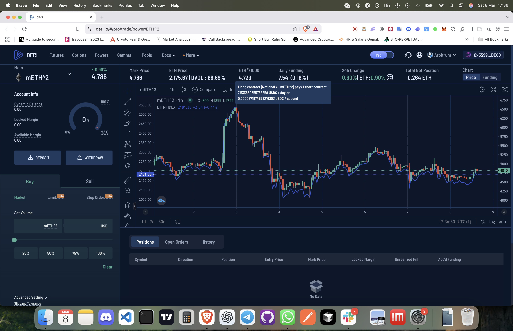  
2.   
3. 

**Observations / Commentary**  
1. **mETH^2 Symbol**:  
   - Non-linear payoff \(\propto ETH^2\). Gains/losses magnified.  
2. **Funding Mechanics**:  
   - Daily funding to keep the squared price near fair value.  
3. **Price & Index**:  
   - Mark Price vs. “ETH^2 /some factor,” potentially less intuitive.  
4. **Separate “Powers” Category**:  
   - DERI labels these under “Powers,” with mBTC^2, mETH^2, etc.  
5. **Funding Chart**:  
   - Fluctuations in daily funding. Squared perps may see higher volatility in funding.  
6. **Net Position**:  
   - “-0.264 ETH” indicates partial squared exposure.

**What It Has**  
- Non-linear payoff (squared), continuous funding, separate category in UI.

**What Might Be Missing (Flow EVM + Cadence)**  
1. **Composability**:  
   - Could combine with lending or options for advanced hedging.  
2. **Automated Liquidation**:  
   - Resource-based partial close if margin dips.  
3. **User-Defined Collateral**:  
   - NFTs, staked tokens, etc.

**Ideas / Suggestions**  
1. **Flow EVM Power Perpetual**:  
   - Create squared or cubed payoffs on-chain, referencing oracles for base price.  
2. **Integrate Options**:  
   - Buy puts or calls alongside the power perp to cap risk.  
3. **Auto-Hedged Pools**:  
   - AMM or vault invests in power perpetuals, receives funding, adjusts risk.  
4. **Transparent Governance**:  
   - DAO manages the factor or funding parameters.

**Comparisons / Where It Could Go**  
- More exotic than standard perps. Flow EVM can unify them with other DeFi tools.  
- Potential next step: implementing a squared payoff with a resource-based margin aggregator.

---

## **Gamma Swap**

### **Screenshot 11 – Gamma Swap**
**Reference**:  

Below is an in-depth overview of **Gamma Swap**, a new derivative for **constant Gamma**. The **long** side obtains a payoff \(\propto (x - x_0)^2\); the **short** side collects funding, with payoff \(\propto -(x - x_0)^2\). This product is for traders needing direct curvature exposure (\(\Gamma\)) or wanting to offset negative Gamma from other positions.

---

### **Gamma Swap Basics**

1. **Pure Constant Gamma**:  
   - \(\mathrm{PnL} \propto (x - x_0)^2\) for longs, \(\mathrm{PnL} \propto -(x - x_0)^2\) for shorts.  
   - No expiry, funding-based approach, zero initial \(\Delta\) if \(x_0\) is the entry price.

2. **Use Cases**:  
   - **Gamma Hedging** (LPs, option writers).  
   - **Speculative Volatility** (bet on big price moves in either direction).

3. **PNL Curve**:  
   - Parabola shape ignoring fees/slippage. Gains/losses scale with \((x - x_0)\)^2.  
   - Minimal payoff if price stays near \(x_0\), large payoff for big deviations.

**How It Differs**  
- **Futures** are linear, **options** have piecewise payoffs, **power perps** do \(x^n\).  
- **Gamma Swap** specifically targets \((x - x_0)^2\).

---

### **Key Mechanics**

1. **Payoff & Funding**:  
   - Long pays funding, short receives it.  
   - Composite mark price from 1 Power Perp minus some multiple of a Perp Future.

2. **Zero Delta Initially**:  
   - If \(x_0\) is current price, \(\Delta=0\) at inception.  
   - \(\Delta\) grows as price deviates from \(x_0\).

3. **Margin & Greeks**:  
   - \(\Gamma \approx \text{constant}\).  
   - \(\Delta\) evolves linearly with \((x - x_0)\).  
   - Greek-based margin might apply a second-order Taylor expansion for worst-case changes.

---

### **Why Not Just Combine Futures + Power Perps?**

- Doing so individually wastes margin on offsetting deltas and adds transaction overhead.  
- Gamma Swap is an all-in-one, more capital-efficient product.

---

### **Practical Applications**

1. **Hedging Impermanent Loss**:  
   - AMM LPs with negative Gamma can buy Gamma Swap to offset.  
2. **Options Market Makers**:  
   - Hedge or manage net \(\Gamma\) without continuous rebalancing.  
3. **Volatility Plays**:  
   - Long side if expecting large moves, short side if expecting price stability.

---

### **Comparison to Flow EVM / Cadence**

1. **Resource-Oriented Composability**:  
   - Single Cadence transaction for margin deposit, opening Gamma Swap, optional leftover yield deposit.  
2. **Integration with DeFi**:  
   - Could borrow stables, open a Gamma Swap, manage partial hedges, all on Flow EVM.  
3. **Advanced Governance**:  
   - Funding and formula updates via on-chain proposals.  
4. **Potential**:  
   - A new frontier for pure \(\Gamma\) trades in a user-friendly, atomic manner.

---

### **Takeaways**

- **Constant \(\Gamma\)** in a single perpetual product.  
- **Mathematically** constructed from power + perp, but more efficient.  
- **New Frontier for DeFi**: Let traders hedge or speculate on curvature.  
- **Risks**: Large price moves can yield big losses for the short side; funding can be volatile.  
- **Use Cases**: Impermanent loss hedge, option \(\Gamma\) hedging, volatility speculation.

By integrating **Gamma Swap** on **Flow EVM** with **Cadence**, traders can seamlessly manage advanced curvature-based strategies, bridging the best of DERI’s on-chain approach with Flow’s resource security and atomic composability.

---

## **Overall Conclusions & Next Steps**

Across **Futures**, **Perpetual Options**, **Power Perpetuals**, and **Gamma Swap**, DERI.IO showcases a robust set of on-chain derivative instruments. **Flow EVM + Cadence** can amplify these products by:

- **Unifying** multi-step transactions into a single resource-oriented contract call (depositing collateral, opening positions, leftover yield deposits, partial liquidation triggers).  
- **Enabling** staked tokens or NFTs as collateral with a discount factor system governed on-chain.  
- **Integrating** with Flow-based oracles, lending, AMMs, yield protocols for cross-protocol margin or advanced vault strategies.

A **“super dApp”** could combine the best aspects of Deribit-like UIs, DERI’s on-chain non-custodial approach, Flow’s resource-oriented security, and new feature ideas (e.g., exotic combos, partial auto-hedge, governance-based discount updates). This synergy has the potential to push DeFi derivatives into more powerful, accessible, and secure territory.

# Platform: Cetus (on SUI)

**Cetus** is a decentralized exchange (DEX) on SUI, offering features like **Swaps** (with an Aggregator mode), **Limit Orders**, and **DCA (Dollar-Cost Averaging)**. Below are initial screenshots highlighting its core trading interface. We’ll then draw parallels to how these features might integrate or be enhanced on **Flow EVM** using **Cadence** and resource-oriented design, especially for advanced strategies like range-based CLMMs or multi-asset leveraged farming.

---

## **Screenshot 1**  
**Title**: *Cetus Swap (Aggregator Mode)*  
**Reference**:  
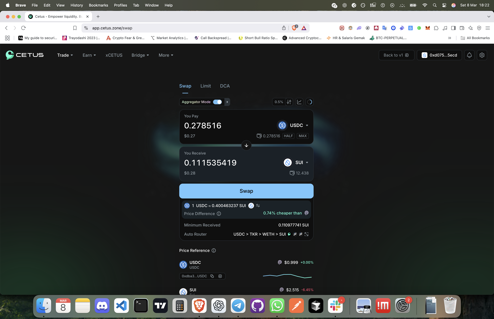

### **Observations / Commentary**

1. **Aggregator Mode**  
   - Cetus can route trades across multiple liquidity sources or pools, aiming for the best price.  
   - The UI calculates your “You Pay” (in USDC) and “You Receive” (in SUI), with a “Price Difference” or “cheaper than X” note to indicate potential savings.

2. **Token Pair & Rate**  
   - In this screenshot, the user is swapping **USDC** to **SUI**. The aggregator displays the effective rate plus minimum received tokens (protecting against slippage).

3. **Slippage & Route**  
   - “0.5%” indicates a chosen slippage tolerance; the route is USDC → TKR → WETH → SUI (hypothetical chain). This route can be hidden or shown in advanced detail.

4. **Auto Router**  
   - The system automatically picks or aggregates routes across different pools or AMMs on SUI.  
   - The user can toggle aggregator mode on or off.

5. **Reference Prices**  
   - Bottom panel shows price references for USDC ($0.999 ~ 1.00) and SUI ($2.515 in the screenshot, down 6.45%). Provides quick context for market conditions.

### **What It Has**

- **1-Click Swaps** with aggregator routing.  
- **Slippage Control** and real-time route breakdown.  
- **Price Indicators** showing relative token values and changes.

### **What Might Be Missing (Flow EVM + Cadence)**

1. **Resource-Oriented Swap**  
   - Instead of typical contract calls, a Flow-based aggregator can unify deposit + swap + leftover yield deposit in one transaction.  
   - Tokens are resources in Cadence, ensuring no accidental token duplication.

2. **Multi-Step Composability**  
   - Combine a swap with lending or an immediate deposit into a CLMM position, all in a single atomic transaction.

3. **Advanced Slippage / Route Governance**  
   - Potential governance to decide aggregator sources or priority on Flow. 
   - If we integrate with a specialized Flow CLMM, could route partial trades or slip in/out of multiple pools.

### **Ideas / Suggestions**

1. **Flow EVM Aggregator**  
   - A built-in aggregator referencing multiple Flow-based DEXes or bridging to external routes.  
2. **Atomic Swap + Derivatives**  
   - Immediately open a leveraged position or an option after swapping.  
3. **Enhanced Slippage Management**  
   - Resource-based checks to revert if the user’s leftover resource is below a certain threshold, or if aggregator results deviate from reference oracles.

### **Comparisons / Where It Could Go**

- **Compared to Standard DEX UI**  
  - Cetus provides aggregator mode, but a Flow-based aggregator might unify more protocols.  
- **Potential Next Steps**  
  - Explore bridging aggregator logic into Flow EVM, referencing multiple CLMM pools.  
  - Possibly integrate with advanced Flow DeFi protocols for partial “range” or multi-asset leveraged strategies.

---

## **Screenshot 2**  
**Title**: *Cetus Limit Orders*  
**Reference**:  
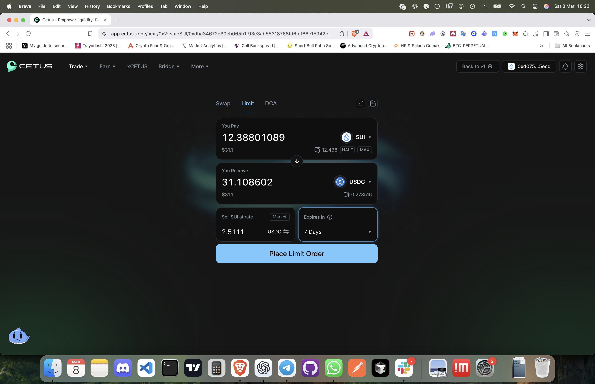

### **Observations / Commentary**

1. **Limit vs. Market vs. DCA**  
   - Next to “Swap,” the user can select **Limit** or **DCA**. This screenshot shows a **Limit Order** to sell SUI for USDC at a chosen rate (2.5111).  
   - Expiry is set to “7 Days,” after which the limit order presumably cancels if unfilled.

2. **Set Volume & Price**  
   - The user enters how many SUI to sell (12.388..., worth \$31.1) and wants to receive 31.108602 USDC if the price hits 2.5111.  
   - The interface calculates the total or partial fill outcome.

3. **Convenient Expiration**  
   - The user can pick a time horizon (7 Days, or possibly indefinite) for the limit order.  
   - Cetus might store this order in a contract or orderbook on-chain.

4. **Slippage & Partial Fills**  
   - Not explicitly shown, but typically limit orders can fill partially if the price is above/below the threshold at some point.

### **What It Has**

- **Basic Limit Orders** on an on-chain DEX environment.  
- **Custom Expiry** for limit order duration.  
- **Simple UI** for specifying the desired rate.

### **What Might Be Missing (Flow EVM + Cadence)**

1. **Resource-Oriented Limit Orders**  
   - Instead of purely ephemeral limit orders, on Flow we can store a user’s “limit order resource,” guaranteeing no double-spending or leftover partial fill confusion.

2. **Multi-Asset Condition**  
   - Potentially define advanced triggers: “Only fill if aggregator can route me a stable price across multiple pools,” or “only fill if I can also borrow at X rate.”

3. **Automated Strategies**  
   - Combine limit orders with a yield aggregator or a CLMM range strategy if the limit is hit.

### **Ideas / Suggestions**

1. **Flow-Based “Order Resource”**  
   - A token-like resource that represents an open limit order. If partial fill occurs, the resource is updated with the new quantity.  
2. **Advanced Expiry & Condition**  
   - The user might chain conditions: “If not filled by day 7 at or above 2.5, revert the tokens to a new strategy.”  
3. **Integration with Lending**  
   - Place a limit order while some of your tokens are still earning interest or staked as partial collateral. If the order fills, the Cadence transaction can auto repay or top up collateral.

### **Comparisons / Where It Could Go**

- **Compared to CEX limit orders**  
  - Cetus provides an on-chain limit order but is simpler. Flow EVM might offer more advanced or composable logic.  
- **Potential Next Steps**  
  - Explore “Conditional Orders” or “Multi-asset limit orders” on Flow.  
  - Possibly unify limit order code with CLMM or advanced aggregator logic.

---

## **Screenshot 3**  
**Title**: *Cetus DCA (Dollar-Cost Averaging)*  
**Reference**:  
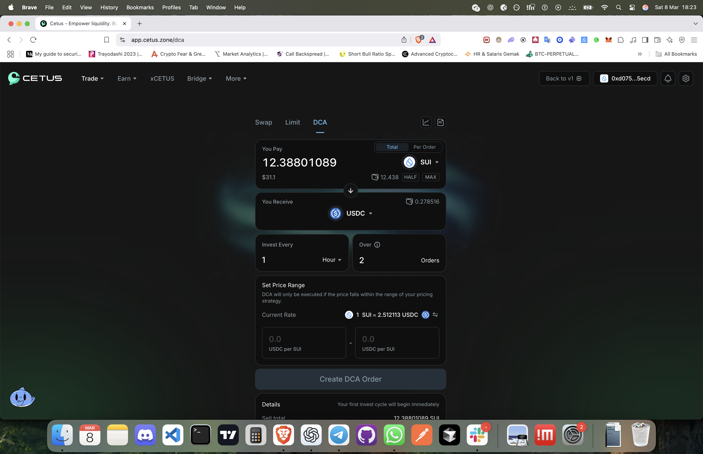

### **Observations / Commentary**

1. **DCA Interface**  
   - The user sets a schedule: invests every 1 hour, over 2 orders, with a “Set Price Range” for the DCA to execute if the price is within that range.  
   - The screenshot shows selling SUI for USDC in increments, presumably to reduce short-term volatility risk.

2. **Frequency & Duration**  
   - “Invest Every 1 Hour,” “Over 2 Orders” means it’ll attempt 2 separate trades an hour apart if the price meets the user’s range.  
   - Could be daily, weekly, or any timeframe if the UI/contract supports it.

3. **Price Range**  
   - The user can define a min or max rate at which they’ll accept the trade. If the SUI/USDC price is outside that range, the DCA skip triggers.

4. **Automated Partial Execution**  
   - The system presumably checks the price feed or aggregator each hour, then executes a partial trade if conditions match.

### **What It Has**

- **Automated DCA** in an on-chain environment, controlling order frequency and price range.  
- **Simple UI** for schedule, total or per-order amounts.

### **What Might Be Missing (Flow EVM + Cadence)**

1. **Resource-Oriented Recurring Orders**  
   - A “DCA resource” could hold user’s tokens and release them in intervals. Partial leftover if not triggered, all governed by a single Cadence contract.

2. **Advanced Multi-Step**  
   - If a DCA order triggers, the system could automatically deposit the newly bought (or sold) tokens into a yield aggregator or open a derivative position.  
   - On Flow, this can be a single “DCA strategy resource” with complex steps.

3. **Cross-Protocol DCA**  
   - Potential aggregator approach: if the user wants to DCA from SUI to multiple stablecoins (USDC, USDT) or even to a lending position, the contract orchestrates everything.

### **Ideas / Suggestions**

1. **Flow “Scheduled Resource Execution”**  
   - Cadence code that unlocks partial amounts at each interval, checking a price oracle or aggregator route.  
2. **DCA with Range or Condition**  
   - If the range is never met, the resource can revert after a certain time, or roll over into a different strategy.  
3. **Integration with Derivatives**  
   - E.g., “DCA into an option writing strategy every hour,” or “DCA into a power perpetual.”

### **Comparisons / Where It Could Go**

- **Compared to Standard DEX DCA**  
  - Cetus’s approach is simplified. Flow can unify it with resource-based param expansions, advanced oracles, multi-protocol deposits.  
- **Potential Next Steps**  
  - Explore bridging the DCA logic to advanced yield or derivative markets on Flow.  
  - Possibly set up recurring “range-bound” DCA that transitions to a CLMM position once filled.

---

## **Why This Matters for Flow EVM**

1. **KittyPunch & CLMM**:  
   - The user references a Flow EVM dApp “KittyPunch” with a CLMM (concentrated liquidity market maker). The DCA feature from Cetus could be integrated so that users can DCA into their CLMM positions.  
   - Resource-based range positions: let the user precisely define the price boundaries for their liquidity, or do partial invests over time.

2. **Multi-Asset Leveraged Farming**:  
   - Another SUI app, mole.fi, does single-asset borrowing for leveraged farming. On Flow, we might want a multi-asset approach plus user-defined CLMM range.  
   - That synergy suggests a single transaction orchestrating borrowing, liquidity provisioning, range setup, DCA expansions, and partial rebalancing.

3. **Cadence: Atomic + Resource-Oriented**  
   - Each user’s position (limit order, aggregator swap, DCA, leveraged farm) is a distinct resource. If partial execution or reverts occur, everything is safe from partial leftover states.  
   - Users can more easily combine advanced steps across different DeFi protocols on Flow.

---

## **Overall Conclusion**

Cetus on SUI provides a robust DEX with **Swap (Aggregator)**, **Limit Orders**, and **DCA**—solid building blocks for user-friendly trading, scheduling, and incremental investing. By **porting these concepts to Flow EVM** and leveraging **Cadence**:

- **Aggregator**: unify multi-pool or multi-protocol routes in a resource-based environment.  
- **Limit Orders**: store them as on-chain resources, enable advanced triggers or partial closes.  
- **DCA**: create a single “recurring order resource,” handling time intervals, leftover tokens, or auto-deploying capital to yield strategies.  
- **CLMM & Leverage**: synergy with a concentrated liquidity approach, plus a more flexible multi-asset borrowing system than existing solutions.

Bringing Cetus’s features together with advanced Flow-based dApps (like KittyPunch CLMM or a multi-asset leveraged farming protocol) can yield a **super dApp** that combines DEX aggregator logic, time-based or range-based investment, and robust resource-oriented user positions. This vision supports deeper composability, safer margining, and a more seamless DeFi user experience on **Flow EVM**.

# Platform: Cetus (on SUI)

Below are additional screenshots showcasing **Cetus’s Liquidity Pools** and **Range Liquidity** (CLMM-style) interface. Cetus provides a flexible interface for liquidity providers (LPs), allowing them to choose specific price ranges or a “conservative/active/full range” preset, somewhat akin to Uniswap v3’s concentrated liquidity. We then consider how these concepts might be integrated or extended on **Flow EVM** with **Cadence** and resource-oriented design.

---

## **Screenshot 4**  
**Title**: *Cetus Liquidity Pools Overview*  
**Reference**:  
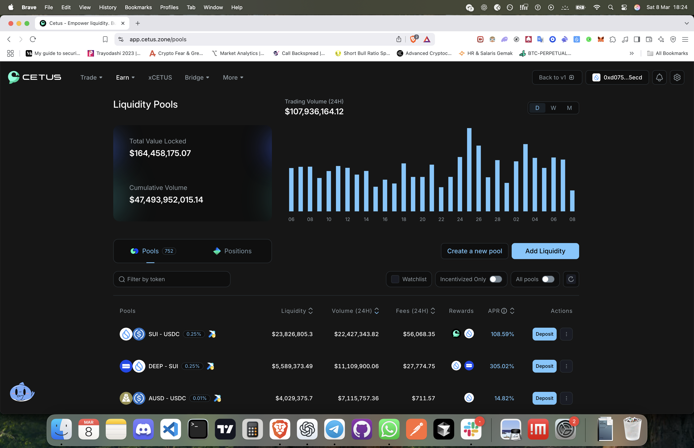

### **Observations / Commentary**

1. **TVL & Volume**  
   - Shows **$164,458,175.07** in total value locked, **$47.49B** in cumulative volume, and a 24h trading volume chart (~$107.94M).  
   - Highlights the platform’s overall scale and user engagement.

2. **Pools vs. Positions**  
   - A toggle to view existing **Pools** (752 in the screenshot) or the user’s **Positions**.  
   - “Add Liquidity” and “Create a new pool” buttons for quick entry.

3. **Pool List**  
   - Example pairs: **SUI–USDC**, **DEEP–SUI**, **AUSD–USDC**, each with liquidity, 24h volume, 24h fees, rewards, and an APR estimate (108.59%, 305.02%, 14.82%, etc.).  
   - The “Deposit” button under “Actions” leads to a range liquidity interface or a standard liquidity deposit flow.

4. **Watchlist / Filter**  
   - Users can filter by token or toggle “Incentivized Only” to find pools offering extra rewards.  

### **What It Has**

- **High-Level Liquidity Stats** (TVL, volume, fees).  
- **Multiple Pools** with different fee tiers or incentives.  
- **APR & Rewards** indicating potential yield from providing liquidity.

### **What Might Be Missing (Flow EVM + Cadence)**

1. **Resource-Based Pool & Position**  
   - Each liquidity position could be a Cadence “resource,” making partial deposits/withdrawals or range updates simpler and safer.  
   - Eliminates confusion around leftover partial tokens or failing transactions.

2. **Integrated Lending/Farming**  
   - Immediately borrow stablecoins (in the same transaction) and deposit them into a chosen pool.  
   - Automate yield strategies or cross-protocol margin with a single atomic transaction.

3. **Multi-Asset Incentive Handling**  
   - On Flow, a governance token or multiple reward tokens could be distributed automatically to the user’s position resource.

### **Ideas / Suggestions**

1. **Flow EVM Pool Explorer**  
   - A resource-based version of the pool list, showing each pool’s details, plus an integrated aggregator to route trades or deposit in the best APR pools.  
2. **Transparent On-Chain Governance**  
   - If fee tiers or incentives change, a Flow-based DAO can manage them. Users can see changes or proposals in a single, resource-based event system.  
3. **Vault Strategies**  
   - For novice users, automatically manage partial rebalancing between multiple pools, or shift from conservative to active range as markets fluctuate.

### **Comparisons / Where It Could Go**

- **Compared to Uniswap v3**  
  - Cetus on SUI is akin to a Uniswap v3 approach with LP range selection. Flow EVM could unify it with resource-based positions for improved clarity and fewer manual steps.  
- **Potential Next Steps**  
  - Integrate advanced bridging (Flow <-> SUI) or replicate Cetus’s CLMM logic on Flow with Cadence.  
  - Possibly add cross-protocol margin or partial liquidation logic.

---

## **Screenshot 5**  
**Title**: *Provide Liquidity (Range Selection)*  
**Reference**:  
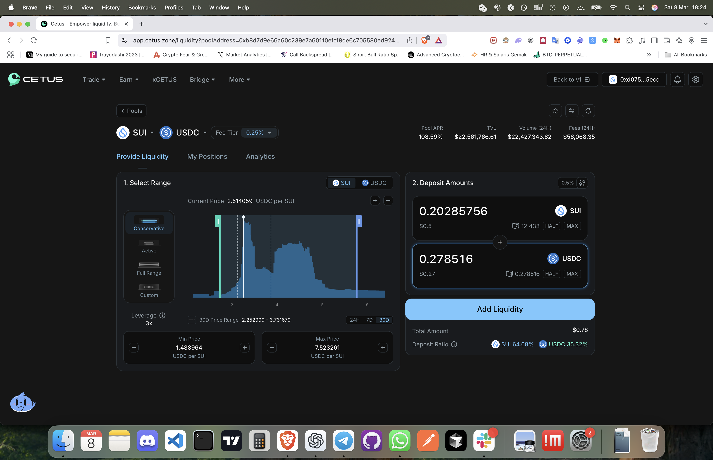

### **Observations / Commentary**

1. **Range Selection**  
   - UI allows choosing a **Conservative**, **Active**, **Full Range**, or **Custom** approach.  
   - The chart shows current price (2.514059 USDC per SUI) and a histogram or heatmap of liquidity distribution.

2. **Leverage**  
   - A toggle for up to “3x” leverage indicates you can deposit fewer tokens but get amplified exposure.  
   - Possibly integrated with a lending module behind the scenes.

3. **Deposit Amounts**  
   - The user can specify how much SUI + USDC to provide. The interface calculates total amounts ($0.78 in the screenshot) and the ratio (SUI 64.68% / USDC 35.32%).

4. **Pool APR & Stats**  
   - Shows 108.59% APR, $22.56M TVL, $22.43M 24h volume, $56k in 24h fees.  
   - Encourages users by displaying potential yields.

5. **One-Step Liquidity**  
   - Pressing “Add Liquidity” finalizes the deposit. The user can manage the position in “My Positions” or see it under the liquidity pool tab.

### **What It Has**

- **CLMM-Style Range**: LPs pick a custom or preset range for their liquidity.  
- **Integrated Chart**: Helps visualize where the price currently sits and where the user’s range will apply.  
- **Leverage**: Possibly an internal leveraged position or a separate loan aggregator.

### **What Might Be Missing (Flow EVM + Cadence)**

1. **Resource-Oriented Range Position**  
   - Each LP position can be a Cadence resource, making partial range updates or expansions simpler.  
   - If the user wants to add more range or shift it, they modify that resource in an atomic update.

2. **Auto-Adjust or DCA**  
   - Could incorporate the DCA feature directly: “Spread my deposit across price bands over time.”  
   - If the user sets a range but wants it auto-shifted if the market moves drastically.

3. **Cross-Protocol Leverage**  
   - Potentially let the user borrow stablecoins from a Flow-based lending protocol in the same transaction, then deposit them in a CLMM range, with a resource-based margin check.

### **Ideas / Suggestions**

1. **Flow EVM “Range Resource”**  
   - The user picks a custom range. That range is minted as a resource, ensuring no accidental duplication or leftover. They can partially withdraw or shift the range with minimal friction.  
2. **DCA + Range**  
   - Set a DCA plan that gradually invests more into the range as price moves or after each interval.  
3. **Advanced Governance on Fee Tiers**  
   - If the protocol wants multiple fee tiers (0.25%, 0.05%), a Flow-based DAO can dynamically adjust them. The user’s position resource updates accordingly.

### **Comparisons / Where It Could Go**

- **Compared to Uniswap v3 Range**  
  - Similar mechanics, but on SUI with a simpler or more streamlined UI.  
  - Flow’s resource approach can reduce confusion about partial positions or leftover tokens.  
- **Potential Next Steps**  
  - Implement a fully resource-based CLMM on Flow. Each position is an NFT-like resource with additional capabilities (e.g., partial merges or expansions).  
  - Add integrated lending or auto-hedging if the user’s margin is threatened by price shifts outside their range.

---

## **Overall Conclusions**

Cetus’s liquidity pools and CLMM approach provide a robust environment for on-chain AMM trading and range liquidity. On Flow EVM, we could **elevate** these features by:

- **Resource-Oriented Positions**: Each LP deposit becomes a unique resource for partial expansions, merges, or shift of range.  
- **Atomic & Composable**: Combine DCA, aggregator swaps, leveraged borrowing, and range liquidity in one Cadence transaction.  
- **Advanced UI/UX**: Offer the user preset strategies (Conservative, Active, Full, Custom) plus multi-asset deposit or auto-hedge.  
- **Governance & Oracles**: Fee tiers or reward parameters managed by on-chain proposals; oracles feeding real-time price data for aggregator or leveraged logic.

Such integrations pave the way for a **super dApp** on Flow EVM that merges CLMM liquidity, DCA, aggregator-based swaps, advanced limit orders, multi-asset leveraged farming, and more—**all** with the safety and composability of resource-oriented design in Cadence.

# Platform: Mole.fi (on SUI)

**Mole.fi** is a leveraged yield-farming protocol on SUI that combines **lending** (borrowing assets) with **CLMM** liquidity provision on **Cetus**. Users can deposit one token, borrow another, and form a leveraged LP position. Below are some screenshots and an overview of its functionality, along with suggestions on how a **Flow EVM + Cadence** approach could expand or improve upon it—especially regarding multi-asset lending, user-defined CLMM ranges, and more resource-oriented flexibility.

---

## **Screenshot 1 & 2**  
**Title**: *Mole.fi Savings & Farm Overview*  
**References**:  
1. 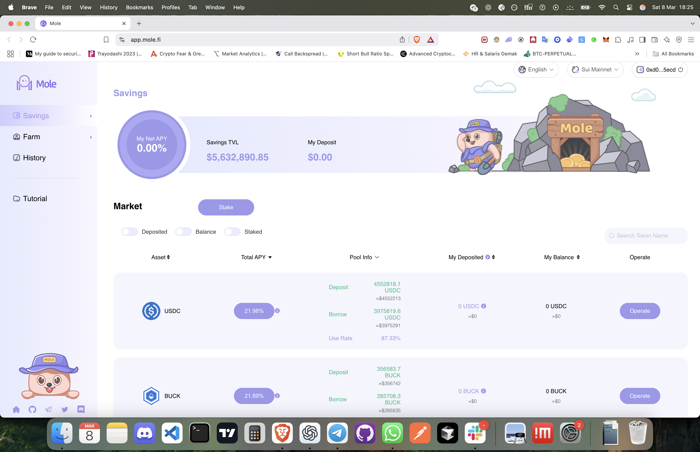  
2. 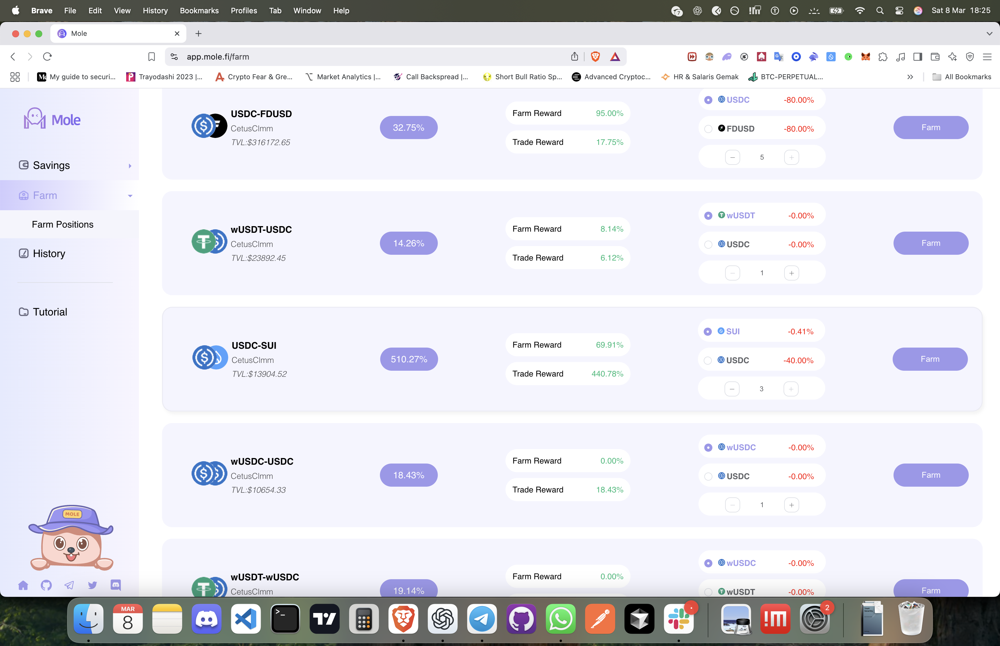

### **Observations / Commentary**

1. **Savings (Lending) Dashboard**  
   - Mole has its own **Savings** section showing a “My Net APY” circle, total **Savings TVL** ($5.63M in the screenshot), and user deposit of $0.  
   - Lists assets (USDC, BUCK, etc.) with deposit/borrow rates. E.g., USDC might have a 21.98% total APY, with a “Deposit” or “Borrow” flow.

2. **Farm Section**  
   - This interface shows “Farm Reward” and “Trade Reward” for each farm. For example:  
     - **USDC-FDUSD** at 32.75% total yield, with 95% Farm Reward and 17.75% Trade Reward.  
     - **USDC-SUI** at a combined 510.27% yield (69.91% farm, 440.78% trade reward).  
   - Each farm is tied to a CetusClmm pool (like USDC-SUI, wUSDT-USDC, etc.).

3. **Back-End for Range**  
   - The platform automatically picks a range on Cetus (the user doesn’t choose). This restricts advanced users who might want more control over their CLMM position boundaries.

4. **Single-Asset Borrowing**  
   - Mole currently only allows borrowing one other asset. They deposit one token, borrow the other, forming a 2-token LP. There’s **no** multi-asset or more complex approach.

### **What It Has**

- **Lending + Farming** in a single interface.  
- Automatic range creation on Cetus.  
- Potentially high APY from farm/trade rewards, especially for more volatile pairs.

### **What Might Be Missing (Flow EVM + Cadence)**

1. **Dedicated Lending Market Integration**  
   - Mole’s internal lending might limit external liquidity or specialized rates. A Flow-based aggregator could integrate with multiple lending protocols for better rates or more collateral options.

2. **User-Defined CLMM Range**  
   - Currently, Mole auto-sets the range for new positions. Flow EVM users might want a custom range or to rely on a “smart range” module.  
   - This could be a separate resource so advanced users can define narrower/wider bounds.

3. **Multi-Asset Borrowing**  
   - Borrow multiple tokens (e.g., partially borrow USDC + partially borrow wETH) to form a tri-token or advanced strategy.  
   - A resource-based approach might unify margin checks for multiple borrowed assets.

4. **Granular Rebalancing Control**  
   - Mole rebalances behind the scenes. Some advanced users might want partial or threshold-based rebalancing triggers, or manual override if they sense big market moves.

### **Screenshot 3**  
**Title**: *Add Assets to Farm (Leverage Setup)*  
**Reference**:  
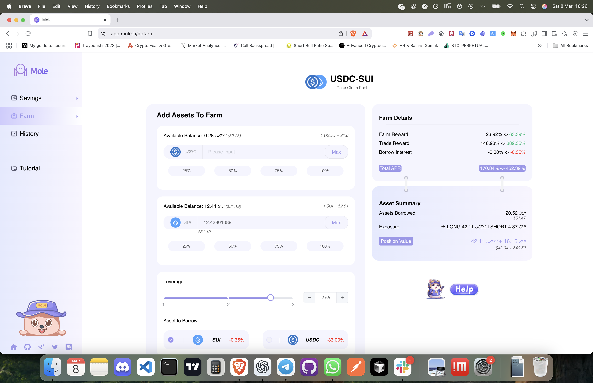

1. **Leverage Slider**  
   - The user can choose leverage from 1–3x, borrowing either SUI or USDC.  
   - “Farm Reward” + “Trade Reward” yields are shown, while “Borrow Interest” is subtracted.

2. **Asset Summary**  
   - E.g., the user has borrowed 20.52 SUI, or 20.52 USDC, forming an LP with 42.11 USDC + 16.1 SUI net exposure.  
   - The system automatically opens a position on Cetus, presumably specifying a default range.

3. **Position Value**  
   - Summarizes the total value of the leveraged position.  
   - The user is effectively **long** one side and **short** the borrowed side if the price changes beyond a certain range.

### **What It Has**

- **One-click Leveraged Farming**: deposit X, borrow Y, auto-add to a Cetus CLMM pool.  
- **Farm Rewards**: Additional token incentives, plus potential trade fees.  
- **Simple UI**: Sliders for leverage, partial or full deposit of user tokens.

### **What Might Be Missing (Flow EVM + Cadence)**

1. **Flexible Multi-Asset**  
   - Users could pick “borrow 40% USDC, 60% ETH,” deposit 1 SUI, forming a tri-asset range in the same pool or across multiple pools.  
   - A single resource-based position tracks all margin and borrowed assets.

2. **User-Defined Ranges**  
   - “Auto-range” might not suit advanced traders. A Flow-based system can allow manual or partial custom ranges, or multiple range segments.

3. **Advanced Rebalancing Triggers**  
   - E.g. rebalancing if price leaves 20% from the center. Or partial liquidation if margin ratio dips below X.  
   - Could unify a user’s entire portfolio in one resource-based aggregator, so leftover yields or borrowed assets can be reallocated on the fly.

4. **Cross-Protocol Lending**  
   - Instead of Mole’s built-in lending, a Flow aggregator could let users pick from multiple lending sources (whichever has the best rate). A resource-based approach ensures atomic safety if any sub-step fails.

### **Ideas / Suggestions**

1. **Flow EVM “Leverage Resource”**  
   - The user’s leveraged position is minted as a single resource, containing borrowed token(s), deposit, range parameters. Rebalancing or partial close modifies this resource in one transaction.

2. **Integration with External Lending**  
   - A universal Flow-based aggregator that can tap X or Y lending protocol, or a stablecoin aggregator for best rates.  
   - The user sees a single “leverage slider,” but behind the scenes, the aggregator picks the best route.

3. **Modular Range**  
   - Offer “Auto-range,” “Manual range,” or “Hybrid range.” If the user picks manual, let them specify min/max. If “Hybrid,” the system adjusts the range if the price deviates 10%, for instance.

### **Comparisons / Where It Could Go**

- **Compared to Traditional Leveraged Farming**  
  - Mole is bridging the gap between lending and CLMM yield. Flow EVM can push this further with multi-step atomic actions.  
- **Potential Next Steps**  
  - Build a “Flow Leverage aggregator” that sees multiple lending pools, merges user-chosen or auto range liquidity.  
  - Possibly incorporate DCA or auto-hedge strategies for the borrowed side if price moves too far.

---

## **Key Takeaways**

- Mole.fi offers a simplified “leveraged yield farm” on SUI, automatically setting a CLMM range on Cetus.  
- Users deposit one token, borrow another, and farm. They lack advanced control over the range or multi-asset borrowing.  
- Flow EVM with Cadence could **expand** these concepts by allowing:

  1. **Choice of Lending Source**  
     - Pick from multiple Flow-based or cross-chain lending markets for best interest rates or flexible collateral.  

  2. **Manual or Auto Range**  
     - Let advanced users define custom CLMM boundaries or rely on algorithmic shifting if they prefer less micromanagement.  

  3. **Multi-Token Borrowing**  
     - Borrow multiple tokens or revolve partial borrow across different assets for more sophisticated LP combos.  

  4. **Resource-Oriented Hedging/Rebalancing**  
     - Each leveraged position is a Cadence resource, with partial modifications or triggers handled atomically.  

By combining Mole’s leveraged farm approach with a more open, resource-based, and multi-protocol aggregator on **Flow EVM**, we can craft a **super dApp** that seamlessly integrates advanced lending markets, user-driven or auto-range CLMM positions, multi-asset borrowing, and dynamic rebalancing. This synergy can unlock more complex yield strategies while providing safer, more flexible margin management through Cadence’s resource paradigm.

# Platform: Francium (on Solana)

**Francium** offers leveraged yield farming strategies on Solana, supporting **neutral farming, long/short farming**, and various simulation tools. It primarily relies on an **AMM with Uniswap v2**-style liquidity pools (e.g., Orca, Raydium), rather than a concentrated liquidity approach. The interface provides graphical simulations for estimated PnL vs. price movements, but does not incorporate advanced range-based LP functionality.

Below are screenshots of **Francium’s** farm interface, followed by an explanation of how **Cetus (CLMM on SUI)**, **Mole.fi (leveraged aggregator on SUI)**, and **Francium (leveraged yield farm on Solana)** concepts can merge into a **unified, more advanced leveraged farming** solution—potentially on **Flow EVM** with **Cadence**.

---

## **Screenshot 1 & 2**
**Title**: *Francium Leveraged Farming Simulator*  
**References**:  
1. 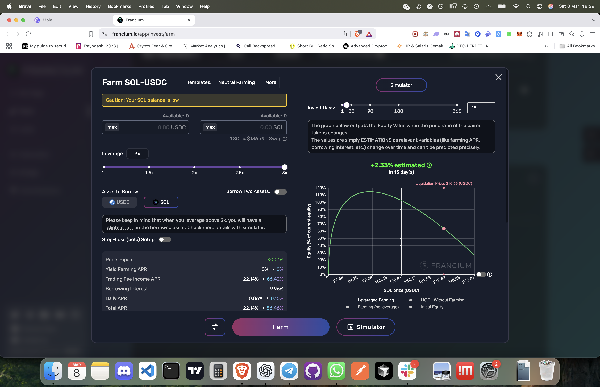  
2. 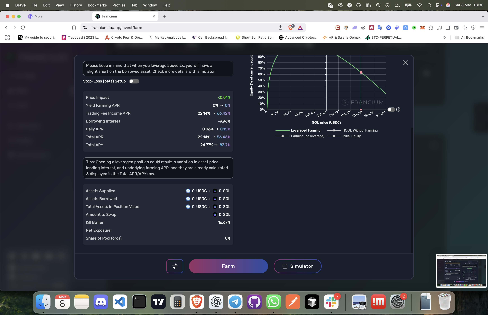

### **Observations / Commentary**

1. **Multiple Farming Templates**  
   - **Neutral Farming**: A balanced approach aiming to reduce directional risk.  
   - **Long Farming**: Extra exposure if the user is bullish on the base asset (e.g., SOL).  
   - **Short Farming**: Allows the user to short the borrowed asset, effectively betting on its price decline.

2. **Simulator Graph**  
   - Shows how the user’s **equity** (percent of current equity) changes relative to the underlying price (SOL price in USDC).  
   - Displays a projected PnL curve over certain time horizons (e.g., 15 days, 30 days).

3. **Leverage Slider**  
   - 1–3x with half steps in between (1.5x, 2.0x, 2.5x). Higher leverage means more borrowed tokens, increasing risk and potential reward.

4. **Stop-Loss (Beta)**  
   - A togglable feature to automatically close positions if they drop below a certain threshold. Helps limit catastrophic losses, though it’s still in testing.

5. **Detailed APR Breakdown**  
   - **Yield Farming APR** (22.14% ~ 66.42% in the example).  
   - **Trading Fee Income APR** (part of the pool’s fee share).  
   - **Borrowing Interest** (~9.96%).  
   - Net daily or total APR after combining those figures.

6. **Assets Supplied vs. Borrowed**  
   - The bottom table shows how much USDC/SOL the user supplies, how much is borrowed, and the net exposure to each token.  
   - “Kill Buffer” or “Position Value” displayed for liquidation risk references.

### **What It Has**

- **Leveraged Farming** with flexible “neutral/long/short” templates.  
- **Simulator** displaying PnL curves vs. price changes.  
- **Stop-Loss** (beta) for partial risk management.

### **What Might Be Missing (Compared to CLMM or Flow EVM + Cadence)**

1. **CLMM/Range LP**  
   - Francium is built on Uniswap v2-like AMMs, so LP positions are spread across 0 to ∞ price range.  
   - Concentrated liquidity offers more capital efficiency but requires specifying min/max price ranges.

2. **Resource-Oriented Positions**  
   - On Flow, each leveraged position (with borrowed tokens, partial hedge, etc.) could be a resource, simplifying partial expansions, rebalancing, or advanced triggers.

3. **Multi-Asset Borrowing**  
   - Still primarily single-asset borrowing.  
   - A Flow aggregator could let users borrow multiple tokens or dynamically shift borrowed asset composition.

4. **Cross-Chain or Multi-Protocol**  
   - Tied to Solana-based liquidity. A Flow aggregator might unify multiple DEXes, or reference bridging solutions for deeper liquidity.

### **Ideas / Suggestions**

1. **CLMM Integration**  
   - Combine Francium’s concept of leveraged yield farming with a concentrated liquidity approach (like Cetus).  
   - The user picks a range (like in Cetus), then obtains borrowed tokens from an aggregator (like Mole), while a simulator (like Francium) shows PnL curves.  
   - This synergy can yield more efficient capital usage and advanced hedging.

2. **Flow EVM Resource**  
   - Each leveraged “neutral farming” or “long farming” position minted as a resource, storing:  
     - Range boundaries,  
     - Borrowed tokens,  
     - Collateral token(s),  
     - Stop-loss parameters,  
     - Ongoing simulation state.

3. **Cross-Protocol Borrowing**  
   - Instead of a single lending source, a Flow aggregator chooses the best rates from multiple markets.  
   - Could also do partial borrowing in multiple stablecoins if beneficial for hedging or yield.

4. **Advanced Stop-Loss**  
   - Resource-based triggers that automatically close or partially reduce the position if certain price/volatility conditions occur.  
   - Composability with Flow oracles for on-chain price feeds.

### **Comparison: How Cetus, Mole, and Francium Fit Together**

- **Cetus**:  
  - A **CLMM** DEX with features like aggregator swap, limit orders, DCA, and range-based liquidity.  
- **Mole.fi**:  
  - A leveraged aggregator on SUI, automatically setting CLMM ranges for the user. But only single-asset borrowing and limited advanced controls.  
- **Francium**:  
  - A Solana leveraged yield-farming platform using v2 AMMs, but offering more strategy templates (neutral, long, short) and a simulator graph.  

Combining the **best** of each:

1. **CLMM from Cetus** → more capital-efficient liquidity with custom range.  
2. **Mole-like aggregator** → bridging or multi-lending integration, so users can borrow and deposit in one flow.  
3. **Francium-like strategy templates + simulator** → “Neutral Farming,” “Long Farming,” “Short Farming,” each with a PnL curve and price-based liquidation or stop-loss triggers.  

### **Flow EVM + Cadence: Unified Leveraged Farming**

- **Resource-Oriented**:  
  Each user’s leveraged LP position is a single resource containing range definitions, borrowed assets, net exposure, and stop-loss triggers.  
- **Multi-Lending**:  
  The aggregator picks any Flow-based lending protocol with best rates or partial distribution.  
- **Advanced Strategy**:  
  - **Neutral**: Minimizes price exposure, focusing on yield from trading fees and farm rewards.  
  - **Long**: If bullish on the base asset.  
  - **Short**: If expecting the borrowed side to drop.  
  - **Custom Range**: Let the user define min/max price for the CLMM portion.  
  - **Stop-Loss** or partial auto-liquidation if the position becomes too risky.  

### **Potential Next Steps**

- **Prototype a “FlowFarm”** dApp merging the logic from Cetus (CLMM + aggregator swap + DCA + range UI), Mole’s leveraged aggregator approach, and Francium’s strategy templates + simulator.  
- **Implement** a resource-based approach to unify deposit, borrow, CLMM range creation, and partial rebalancing in one atomic transaction.  
- **Optional** bridging or cross-chain integration for assets from SUI, Solana, or Ethereum if desired.

---

## **Conclusion**

**Francium** offers robust leveraged farming strategies on Solana but is tied to a Uniswap v2-like AMM. By merging **Francium’s** advanced strategy templates and simulator with a **CLMM** model (like **Cetus**) and a leveraged aggregator approach (like **Mole.fi**), we can create a **highly configurable, capital-efficient** leveraged farming platform. 

On **Flow EVM**, **Cadence** can orchestrate everything via **resource-oriented** positions that incorporate:

- **Multi-lending** sources,  
- **User-defined or auto range** CLMM,  
- **Neutral/long/short** strategy templates,  
- **Stop-loss** triggers,  
- **One-click** partial liquidation or rebalancing.

This synergy enables a **super leveraged farming dApp** with advanced yield optimizations, deeper risk controls, and user-friendly UI, all while leveraging the unique composability and safety features inherent to Flow’s resource-based architecture.