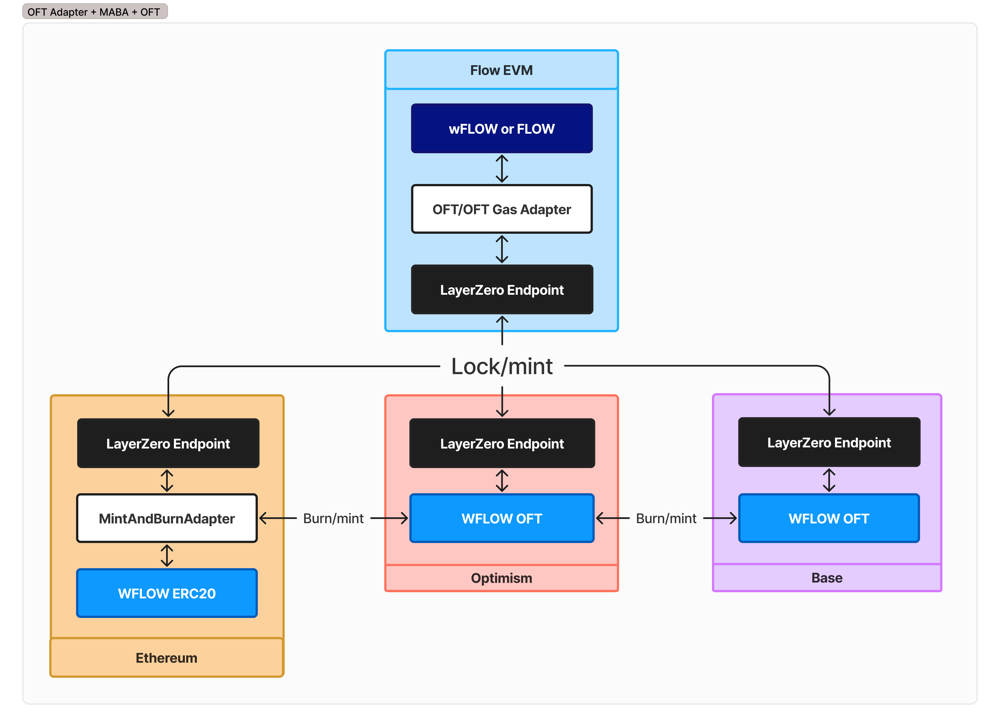

## Diagrams

## Contracts

- Native OFT Gas Adapter which uses msg.value instead of the approve() and transferFrom(), that contract is here: https://github.com/LayerZero-Labs/devtools/tree/main/examples/native-oft-adapter
- And on the Ethereum side you'll need the MintBurnOFTAdapter located here: https://github.com/LayerZero-Labs/devtools/tree/main/examples/mint-burn-oft-adapter

## Sequence

1. Deploy native gas adapter & MintBurnOFTAdapter, give MABA burn/mint rights
2. Collateralize native gas adapter
3. Wire everything together